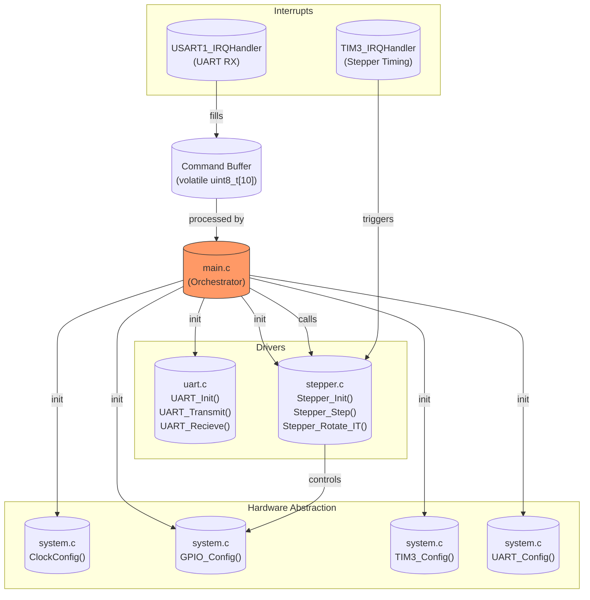

# Proba_Stepper

```mermaid
flowchart TD
 subgraph HAL["Hardware Abstraction"]
        clock[("system.c
        ClockConfig()")]
        gpio[("system.c
        GPIO_Config()")]
        tim[("system.c
        TIM3_Config()")]
        uart_conf[("system.c
        UART_Config()")]
  end
 subgraph DRIVERS["Drivers"]
        uart[("uart.c
        UART_Init()
        UART_Transmit()
        UART_Recieve()")]
        stepper[("stepper.c
        Stepper_Init()
        Stepper_Step()
        Stepper_Rotate_IT()")]
  end
 subgraph ISRs["Interrupts"]
        uart_isr[("USART1_IRQHandler
        (UART RX)")]
        tim_isr[("TIM3_IRQHandler
        (Stepper Timing)")]
  end
    main[("main.c
    (Orchestrator)")] -- init --> clock & gpio & tim & uart & stepper & uart_conf
    uart_isr -- fills --> buffer[("Command Buffer
    (volatile uint8_t[10])")]
    buffer -- processed by --> main
    main -- calls --> stepper
    tim_isr -- triggers --> stepper
    stepper -- controls --> gpio

     main:::orange
    classDef orange fill:#f96,stroke:#333
    classDef blue fill:#6af,stroke:#333
    classDef green fill:#5d5,stroke:#333

```